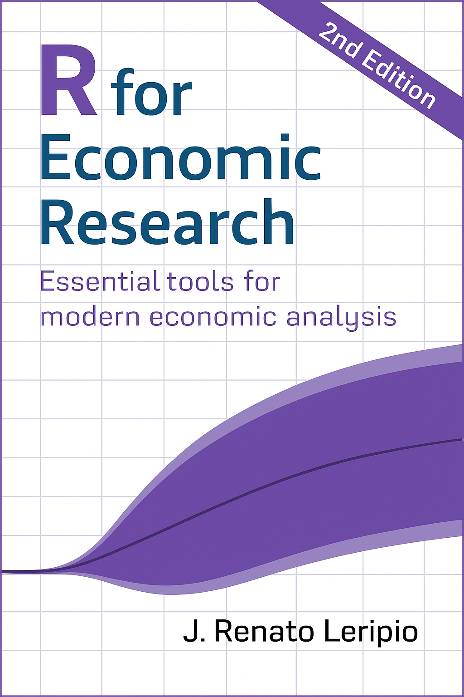

# R for Economic Research



**R for Economic Research** is a practical guide that teaches essential tools for data analysis and modeling in economics using the R programming language.  
It covers real-world applications ranging from data cleaning and visualization to time series analysis and forecasting.

The book is aimed at economists, researchers, and data professionals who want to enhance their analytical skills using open-source tools.

---

## 📦 Companion Package

All datasets used in the book are available in the R package [`R4ER2data`](https://github.com/leripio/R4ER2data).

You can install it directly from GitHub:

```r
install.packages(
  "https://github.com/leripio/R4ER2data/releases/download/v1.0.0/R4ER2data_1.0.0.tar.gz",
  repos = NULL,
  type = "source"
)
```

---

## 📖 License and Contributions

This project is open for contributions and feedback.  
For licensing information, see the [LICENSE](LICENSE) file.

---
